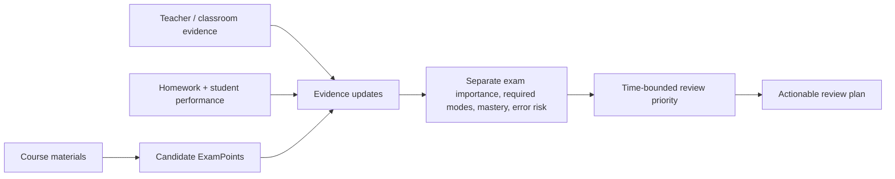

# University Exam Review Skill

**Evidence-grounded, instructor-aware university exam review Agent Skill.**  
Currently validated on ChatGPT; behavior on other Agent Skills-compatible agents has not yet been evaluated.

## What this does

This Skill helps university students build and update an exam review plan from course materials, classroom reports, teacher requirements, homework, student performance, and the study time remaining.

Instead of treating everything in a PPT as equally important, it keeps separate:

- **course coverage** — what appears in the materials;
- **instructor evidence** — what the teacher actually emphasized, required, de-emphasized, or warned about;
- **mastery requirements** — what the student needs to recall, understand, derive, apply, or calculate;
- **student mastery** — what the student has demonstrated, missed, or not yet tested;
- **review priority** — what is most valuable to study next given the remaining time.

## 30-second workflow

A typical interaction looks like this:

1. Upload course materials → build an inspectable candidate scope without guessing exam importance.
2. Add teacher/classroom evidence → update only the affected skills and required depth.
3. Add homework or student responses → update mastery without rewriting teacher intent.
4. State the time remaining → reprioritize what to review, what to check briefly, and what to defer.

## Why

- Course coverage is not the same as exam importance.
- Teacher intent is not an AI inference.
- Exam importance is not student mastery.
- Homework presence does not establish student weakness.
- Required depth can change over time.
- Limited study time calls for prioritization rather than exhaustive summarization.

## Core design

The Skill organizes a course into atomic **ExamPoints** and connects them to **Evidence Events** through scoped links. It tracks exam importance, mastery requirements, student mastery, and common errors as distinct information. Review priority combines these signals with the available time. Requirement updates can change what depth is needed while preserving earlier evidence.

Key behaviors include:

- evidence provenance and scoped updates;
- separation of exam importance and student mastery;
- preservation of conflicting or historical instructor evidence;
- local attribution of homework errors;
- preservation of positive mastery evidence;
- ambiguity handling with `Unknown` / unresolved states;
- active-recall review loops;
- time-bounded triage and explicit deferral.

## Installation

### ChatGPT Skills

If your ChatGPT account has Skills access, upload [`skill/university-exam-review/SKILL.md`](skill/university-exam-review/SKILL.md), or package the `skill/university-exam-review/` directory as a ZIP and upload it. Skills availability depends on your ChatGPT account and environment.

The current frozen release package is available from the GitHub Release:

**[Download v0.2.3-RC1](https://github.com/CONXERED/university-exam-review-skill/releases/tag/v0.2.3-rc1)**

### Other agents

The core workflow is written as a portable `SKILL.md`-style Agent Skill. Other Agent Skills-compatible platforms may be able to reuse or adapt it, but the current validation results are **ChatGPT-only**. Do not assume identical behavior across models or platforms without testing.

## Basic usage

Start with course evidence and ask to inspect the proposed scope:

> Here are my course slides. First build an inspectable candidate scope. I have not told you what the instructor emphasizes yet.

Add instructor requirements when you have them:

> My instructor said this method is very important, but the full derivation is not required.

Add student-performance evidence:

> I got the setup right, but I repeatedly made a sign error in the final force direction.

Then ask for a plan that fits your remaining time:

> I have three hours left before the exam. What should I review first?

## Validation

In controlled synthetic evaluation scenarios using real course-domain materials and synthetic instructor/student evidence, v0.2.3 scored:

- **Fluid Mechanics:** 11/12 — PASS
- **Mechatronics:** 10/12 on two independent valid runs
- **Disqualifiers:** none in valid v0.2.3 runs

See [the evaluation summary](docs/EVALUATION.md).

These results are evidence of controlled behavior on the tested scenarios, not proof of universal performance across university courses.

## Known limitations

- Exact five-level exam-importance calibration is less stable than final review priority.
- Internal ExamPoint granularity may vary across runs.
- Validation currently covers two course domains.
- The Skill does not predict exam content with certainty.
- Instructor evidence supplied by a student may itself be incomplete.
- Cross-model / cross-platform behavior has not yet been benchmarked.

## Version

**v0.2.3 — Cross-course RC1**

Canonical `SKILL.md` SHA256: `C92571B66946CA6B58CDA5263D36A4479EEC5FC93CBC7C4B7D32DB68B846954A`

Frozen release: [`v0.2.3-rc1`](https://github.com/CONXERED/university-exam-review-skill/releases/tag/v0.2.3-rc1)
